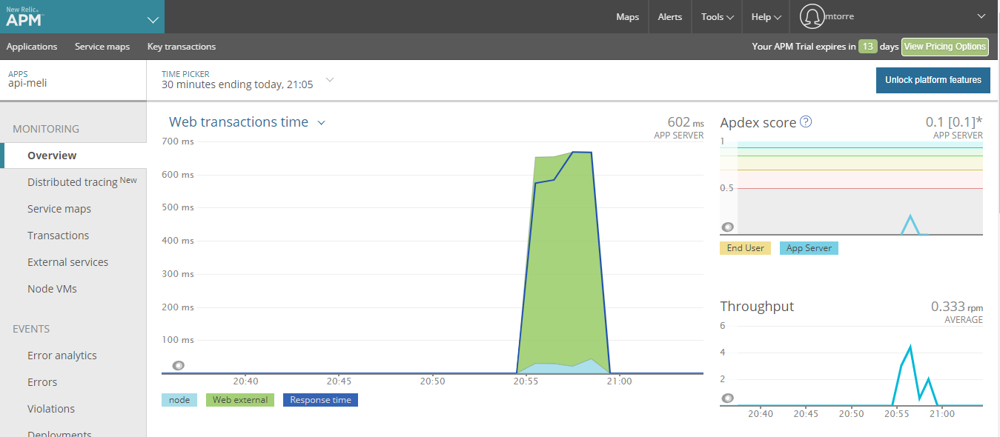
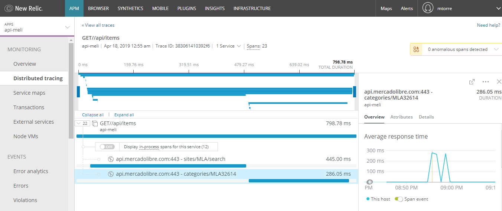

# backend-meli

Backend de la aplicación interview de mercadolibre.

[](https://travis-ci.com/mtorre4580/back-meli)
[](https://coveralls.io/github/mtorre4580/back-meli?branch=master)
[](https://conventionalcommits.org)

## Overview
La aplicación fue desarrollada con [Node](https://nodejs.org/es/).
Se utilizó [Typescript](https://www.typescriptlang.org/) para evitar problemas en runtime en el typing de datos, 
[Compression](https://www.npmjs.com/package/compression) para comprimir todo lo que se envía (middleware básico)
[Express](https://expressjs.com) como framework base, [SanitizeHTML](https://www.npmjs.com/package/sanitize-html) para evitar problemas en la descripción en el detalle ya que viene en html crudo.
Tracking de errores utilizando [Newrelic](https://newrelic.com/), distribution tracing.
[Jest](https://jestjs.io/) para testing y [Supertest](https://www.npmjs.com/package/supertest) para levantar el server y mock de datos verificar el flujo completo.
[Axios](https://github.com/axios/axios) como cliente HTTP.
Se siguió como buena practica definir por funcionalidad en vez de por tipo de elemento (controllers, services, etc)
Todo lo relacionado a items se encuentra en `src/items`
Middleware para el manejo de errores globales.
[PM2](http://pm2.keymetrics.io/) para producción (4 instancias)
Se integra el modulo [dnscache](https://www.npmjs.com/package/dnscache) para mejorar la performance en las peticiones cachea los dns

Se puede acceder al [CHANGELOG](https://github.com/mtorre4580/backend-meli/blob/master/CHANGELOG.md)
Development - Master

## Start Api

``` 
$ npm install
```

``` 
$ npm run dev
``` 

## Build and Release

``` 
$ npm build
```

``` 
$ npm release
```

## Configuration

La aplicación cuenta con diferentes configuraciones para los ambientes dev, staging, prod, se 
pueden encontrar en `src/config`
Esto permite tener los archivos de configuracion y los resources parametrizados.

## Test (Jest / Supertest)

La aplicación cuenta con test para verificar el flujo completo de la api de items `items.service.spec.ts`

```
$ npm run test
```

## Newrelic

Tracking de errores, distribution tracing configuración en `newrelic.js`

## Newrelic - Overview
<div style="text-align:center;margin:auto">
    
</div>

## Newrelic - Tracing
<div style="text-align:center;margin:auto">
    
</div>

## Semantic Commits

Se realiza la integración con commits semanticos que permiten tener luego a partir de estos un CHANGELOG autómatico a la hora de realizar una release. (feat, style, chore...)

Formato: `<type>(<scope>): <subject>`

## Docker

Se agregó una configuración de docker `dockerfile` `docker-compose`
La misma copia los archivos esenciales para el deploy a producción, instala las dependencias.
Instala pm2 para manejar los procesos de node, levanta 4 instancias más info en el archivo `process.yml`

```
$ docker-compose up
```

## Performance (HTTP benchmarking)

Para verificar la performance de la API se generó un script básico que simula varias peticiones HTTP a un endpoint
utilizando [AutoCannon](https://github.com/mcollina/autocannon), hay que tener el servidor funcionando para correrlo
abrir 2 consolas.