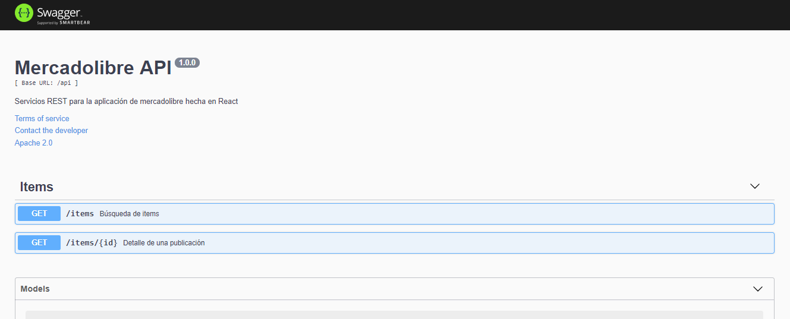

# api-meli

Mercadolibre interview application API.

[](https://travis-ci.com/mtorre4580/back-meli)
[](https://coveralls.io/github/mtorre4580/back-meli?branch=master)
[](https://camo.githubusercontent.com/3602baed9c4e8b40cdb86f5309e282fbe0af58d0/68747470733a2f2f696d672e736869656c64732e696f2f62616467652f52656e6f766174652d656e61626c65642d627269676874677265656e2e737667)
[](https://conventionalcommits.org)

## Overview
The application was developed with [Node](https://nodejs.org/es/).
It was used [Typescript](https://www.typescriptlang.org/) to avoid runtime problems in data typing, 
[Compression](https://www.npmjs.com/package/compression) to compress everything that is sent (basic middleware)
[Express](https://expressjs.com) framework default, [SanitizeHTML](https://www.npmjs.com/package/sanitize-html) to avoid problems in the description in detail since it comes in raw html.
Tracking errors [Newrelic](https://newrelic.com/), Distribution tracing.
[Jest](https://jestjs.io/) for testing and [Supertest](https://www.npmjs.com/package/supertest) to raise the server and data mock check the complete flow.
[Axios](https://github.com/axios/axios) client HTTP
It was followed as a good practice to define by functionality instead of by type of element (controllers, services, etc)
Everything related to items is in `src/items`
Middleware for handling global errors.
[PM2](http://pm2.keymetrics.io/) for production (4 instances)
Add module [dnscache](https://www.npmjs.com/package/dnscache) to improve request performance caches dns

[CHANGELOG](https://github.com/mtorre4580/backend-meli/blob/master/CHANGELOG.md)
Development - Master

## Start Api

``` 
$ npm install
```

``` 
$ npm run dev
``` 

## Build and Release

``` 
$ npm run build
```

``` 
$ npm run release
```

## Configuration

The application has different settings for the dev, staging, prod, se
can find in `src/config`
This allows to have the configuration files and the parameterized resources.

## Test (Jest / Supertest)

The application has tests to verify the complete flow of the items api `items.service.spec.ts`

```
$ npm run test
```

## Newrelic

Tracking errors, distribution tracing configuration in `newrelic.js`

## Newrelic - Overview
<div style="text-align:center;margin:auto">
    
</div>

## Newrelic - Tracing
<div style="text-align:center;margin:auto">
    
</div>

## Swagger 

API documentation can be accessed from the swagger

[Swagger](http://localhost:5000/api-docs)

<div style="text-align:center;margin:auto">
    
</div>

## Semantic Commits

The integration is made with semantic commits that allow to have afterwards an automatic CHANGELOG when making a release. (feat, style, chore ...)

Formato: `<type>(<scope>): <subject>`

## Docker

Added a docker configuration `dockerfile`` docker-compose`
It copies the essential files for the deployment to production, installs the dependencies.
Install pm2 to handle node processes, raise 4 more info instances in `process.yml` file
```
$ docker-compose up
```

## Performance (HTTP benchmarking)

To verify the API performance, a basic script was generated that simulates various HTTP requests to an endpoint
using [AutoCannon] (https://github.com/mcollina/autocannon), you have to have the server working to run it
open 2 consoles.

## Renovate

Integration with renovate bot to have updated versions of dependencies, perform pull request
In development, it is configured to be done manually for security 
